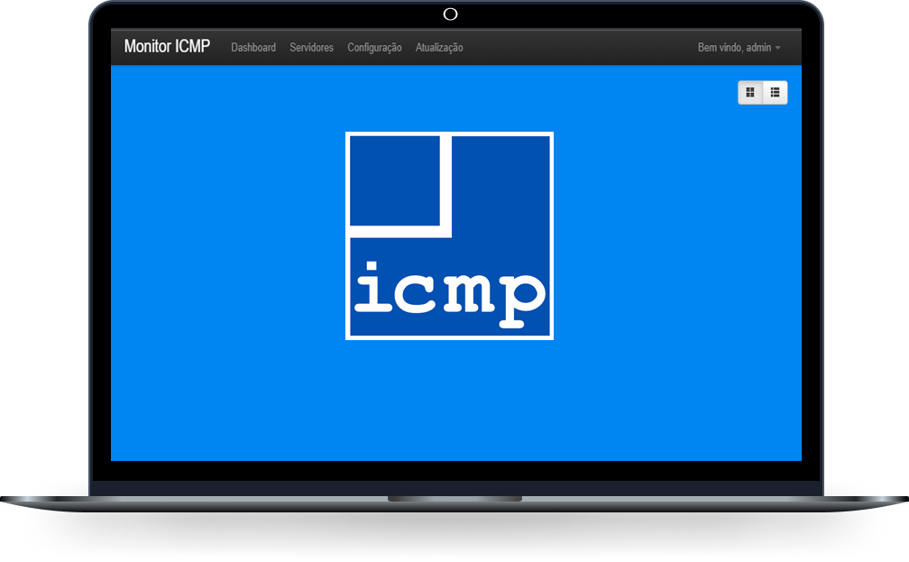

# <p align="center">Projeto Monitor-ICMP</p>

<p align="center">
  
</p>

## 📖 Sobre
O projeto **Monitor-ICMP** trata-se de uma modificação do projeto **[PHP Server Monitor](https://github.com/phpservermon/phpservermon)**, Foi alterado toda a estrutura de teste ICMP não sendo mais necessário a utilização do script de monitoração Cron. Os testes estão sendo realizado diretamente no dashboard através da função exec (Executa um programa externo), Também foi acrescentado alerta sonoro no projeto.
<br><p align="center">⏳ Correções e novas funcionalidade será implementado em breve</p>
```
$ping = exec ("ping -n 2 $ip", $output, $status);
if ($status == 0) {
    echo "on"
    }else{
     echo "off"
    }
```


---

## 🚀 Tecnologias e ferramentas utilizadas
- **PHP**
- **HTML5**
- **CSS3**
- **JavaScript**

---

## 🔧 Como executar o projeto
1 - Copia dos arquivos, opção git clone:
```bash
# Clone o repositório
git clone https://github.com/azsantoss/Monitor-ICMP
# Entre no diretório
cd Monitor-ICMP
```
2 - Renomeie o arquivo "config.php.sample" para "config.php"
3 - Configure as suas credenciais do Banco de dados do arquvio config.php. (usuario, senha e base de dados).
```bash
define('PSM_DB_USER',  'usuario-mysql');
define('PSM_DB_PASS',  'senha-mysql');
define('PSM_DB_NAME',  'banco-teste');
```
4 - Execute o arquivo install.php para prosseguir com a instalação:
```bash
http://SeuIp/Monitor-ICMP/install.php
```
---

## 📝 Licença

O projeto está sob a licença MIT. Para saber mais, acesse o arquivo [LICENSE](https://github.com/azsantoss/Monitor-ICMP/blob/main/LICENSE).

---

## Contato ✉️
| <a target="_blank" href="https://www.linkedin.com/in/andersonsantos2610/"><br><sub><p align="left"></a></p></sub> |
| :---: |
